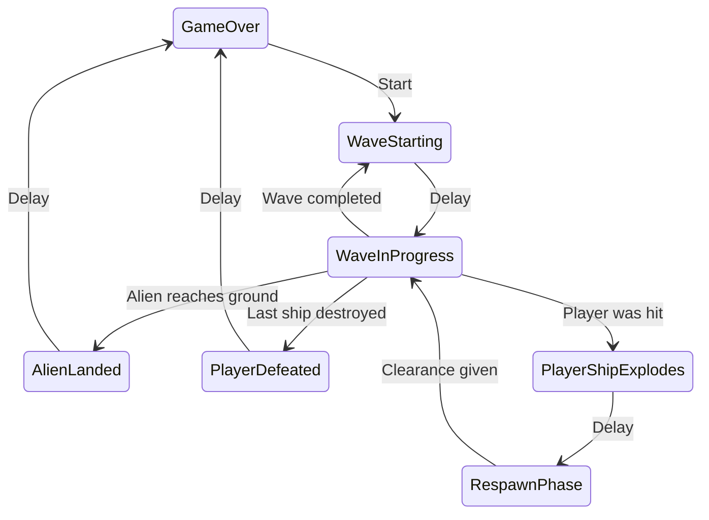
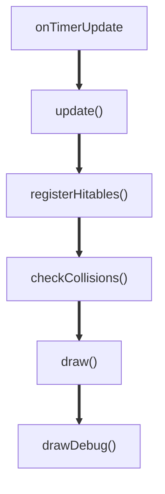
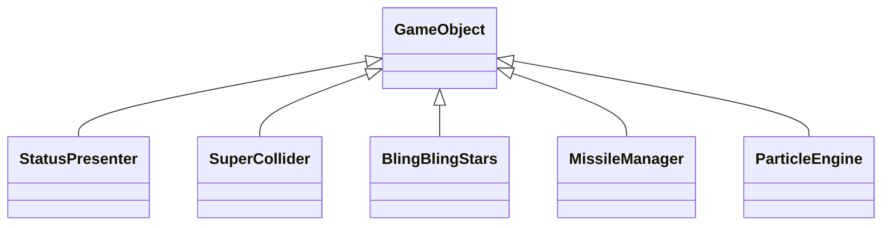
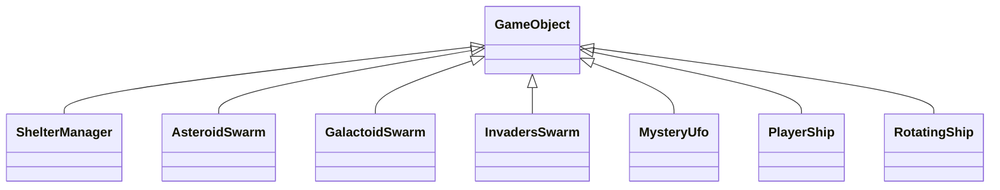
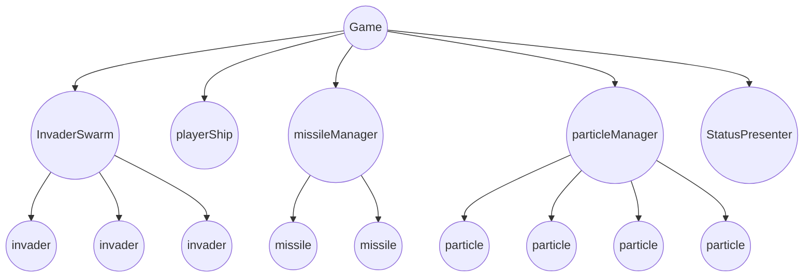

# Software Architecture

<!-- vscode-markdown-toc -->
* 1. [Global Game State](#global-game-state)
* 2. [Worker Thread](#worker-thread)
* 3. [Game Objects](#game-objects)
    * 3.1. [Introduction](#introduction)
    * 3.2. [Generic GameObjects](#generic-gameobjects)
        * 3.2.1. [StatusPresenter](#statuspresenter)
        * 3.2.2. [The SuperCollider](#the-supercollider)
        * 3.2.3. [ParticleEngine](#particleengine)
        * 3.2.4. [BlingBlingStars](#blingblingstars)
        * 3.2.5. [MissileManager](#missilemanager)
    * 3.3. [Specific GameObjects](#specific-gameobjects)
        * 3.3.1. [ShelterManager](#sheltermanager)
        * 3.3.2. [AsteroidSwarm](#asteroidswarm)
        * 3.3.3. [GalactoidSwarm](#galactoidswarm)
        * 3.3.4. [InvadersSwarm](#invadersswarm)
        * 3.3.5. [MysteryUfo](#mysteryufo)
        * 3.3.6. [PlayerShip](#playership)
        * 3.3.7. [RotatingShip](#rotatingship)
* 4. [Handling of effects](#handling-of-effects)
* 5. [Changing the Game State](#changing-the-game-state)

<!-- vscode-markdown-toc-config
	numbering=true
	autoSave=true
	/vscode-markdown-toc-config -->
<!-- /vscode-markdown-toc -->


## Introduction

This document describes the software architecture of the game. It is not a complete documentation of the source code but it should give a good overview of the most important aspects.  
The game is written in Kotlin and uses the Android framework. The game is running in a single activity and uses a single view. The game is running in a single thread.

## Why this was created

This game was created as a tribute to the original Space Invaders game. It was also a good opportunity to learn Kotlin and to get familiar with the Android SDK.

## How to compile

The game is written in Kotlin and uses the Android SDK. So you need to install Android Studio to compile the game.

## How to run

The game can be run on any Android device. Just install the APK file from the `release` folder.

## How to play

The game is a clone of the classic arcade game "Space Invaders" but goes a bit further. The following rules apply for the first wave:

* You control a spaceship at the bottom of the screen.
* You can move left and right and shoot missiles.
* The aliens are moving from left to right and back.
* They are shooting missiles as well.
* If an alien reaches the bottom of the screen the game is over.
* If you are hit by an alien missile you loose one ship. If you have no more ships the game is over.

The game is divided into waves. Each wave is a bit harder than the previous one.

The second wave is a clone of Galaga but with the design of Space Invaders.

The third wave is a clone of Asteroids but again with the design of Space Invaders.

After the third wave the game starts again with the first wave but with a higher difficulty level.

## How to control the game

The game is controlled by the following keys:

| Key   | Action     |
|-------|------------|
| Left  | Move left  |
| Right | Move right |
| x     | Shoot      |

Alternatively you can use the on screen buttons.
Also a gamepad can be used. 


##  1. <a name='global-game-state'></a>Global Game State




##  2. <a name='worker-thread'></a>Worker Thread 

To avoid all those problems that may occur in context of multithreading the simple solution is to avoid multi threading as much as possible.

The only worker thread is a loop that sleeps for a given time period and then sends a post message to the main thread.

```kotlin
        while (playing) {
            Thread.sleep(sleepInterval)

            val t1 = System.currentTimeMillis()
            val deltaT = (((t1 - t0) / 1000.0).toFloat()).coerceIn(0f, .1f)
            t0 = t1

            post {
                currentGame.onTimerUpdate(deltaT)
                invalidate()
            }
        }
```
The post() method of Android.view is solving all multi-threading issues cause the given lambda is sent to the user interface thread and then executed there. So effectively the whole game is running in the user interface threat.


##  3. <a name='game-objects'></a>Game Objects
###  3.1. <a name='introduction'></a>Introduction 
The game is organized into a classic game loop. This is a different approach than making software fully event driven and might sound inefficient.
But for game development this approach is still a great choice.

At the beginning of the game a number of so called GameObjects are being created. Each game objects has one specific purpose and knows as less as possible about other GameObjects. 

All GameObjects have something in common:

* They provide an `update()` method which enables them to update their inner state based on time passing by.
The game logic belongs mostly here.

* They provide a `draw()` method to visualize their current state on screen.
During a draw() call no state shall be updated or changed.

A typical thing in any retro computer game is the collision of one game object with another. The missile hits the alien, the asteroid hits the players ship etc. So many different types of interactions might occur but we want the GameObjects to know as least as possible about their targets or about the agressor which has hit them.

To achieve this the game calls `registerHitables()` on each gameObject on every cycle of the main loop. During this call all hitable actuators will be registered but so far no interaction takes place. This is just the register cycle.

In the next step the game will call `checkCollisions()` on each gameObject. When a collision is detected a lambda will be called to process the collision further. By this gameObjects get notify about collisions with other actors and can handle the these interactions.

The following diagram shows the sequence of calls for all GameObjects:



###  3.2. <a name='generic-gameobjects'></a>Generic GameObjects



####  3.2.1. <a name='statuspresenter'></a>StatusPresenter
Displays the game status like score, hi-score, round and ships left.

####  3.2.2. <a name='the-supercollider'></a>The SuperCollider

#####  3.11.1. <a name='the-generic-collision-detection-problem'></a>The generic collision detection problem

In a typical computer game  many objects are interacting with each other. For each single frame we must know if one object collides with another one and if actions are needed.

If we have m actors in the game we must check m² possible interactions in each game step. So we have a O(n²) complexity which is not nice. If our game should run efficiently also on small platforms like an mobile phone  we should look for alternatives.

#####  3.11.2. <a name='quad-trees-for-collision-detection'></a>Quad Trees for collision detection

A better approach would be to register things in a map that then efficiently can return things that are _nearby_. Any only for _nearby_ objects we would need to do in detail collision detection.

The map should handle nearness flexile for big and small things. 

To do exactly this we register all objects in a [Quad Tree Map](https://en.wikipedia.org/wiki/Quadtree). 

As updates inside of a quad tree map are complex and inefficient we re-create the complete map on each game step. 

The time to create the map is linear so that we have O(n) here. 
And the time to check collisions afterwards is just O(log n) for a single actor. With n actors we see just a complexity of O(n * log n).

#####  3.11.3. <a name='but-why-is-it-a-game-object?'></a>But why is it a Game Object?

You might argument that collision dectection service is a generic thing that makes sense in any game engine. But for what reason should we make the collision detection a GameObject?

Actually this was only done to simplify debugging. 

If a certain debug flag is set the SuperCollider can draw its internal state into the playground. 


####  3.2.3. <a name='particleengine'></a>ParticleEngine
Responsible for all kind of small, moving particles.
Particles are typical small dots or rectangles that move quickly and have a limited typical lifetime around 0.5 sec until 5 sec.

####  3.2.4. <a name='blingblingstars'></a>BlingBlingStars
Displays animated, blinking stars in the background of the playground.

####  3.2.5. <a name='missilemanager'></a>MissileManager
Presents moving missiles. Missiles can be created by both, the player or the attackers.

###  3.3. <a name='specific-gameobjects'></a>Specific GameObjects

While the generic GameObjects are reuseable components that can be used in multiple retro games the specific GameObjects are designed to model parts of some very specific games like Asteroids, Space Invaders or Galaga.



####  3.3.1. <a name='sheltermanager'></a>ShelterManager
Models the shelters for Space Invaders. 
Shelters are destructable and provide protection against enemy missiles.

####  3.3.2. <a name='asteroidswarm'></a>AsteroidSwarm
Name says it all. Manages a swarm of moving, destructable asteroids.

####  3.3.3. <a name='galactoidswarm'></a>GalactoidSwarm
Smarter aliens that follow a bezier curve when moving. 

####  3.3.4. <a name='invadersswarm'></a>InvadersSwarm
Aliens with a very simple movement pattern, very close to the original space invaders. When one or more aliens hit the left or the right screen border, that whole swarm moves one step closer to the player ship and then changes the direction of horizontal movement.

####  3.3.5. <a name='mysteryufo'></a>MysteryUfo
The Mystery Ufo apperas on random interval on the upper part of the screen. It moves from left to right or from right to left producing some noise.

####  3.3.6. <a name='playership'></a>PlayerShip
A simple ship that can move left or right and fire missiles.

####  3.3.7. <a name='rotatingship'></a>RotatingShip
A player ship that can be rotated and move forward.
Forward movement is softly damped. While there would be no damping in real space this ship has a certian level of damping.



##  4. <a name='handling-of-effects'></a>Handling of effects

Effects are the cherry on the cake for every arcade game. The definition of effect in our case is, that is has an visual and possible also auditive result but no implication for the game progress. It's just there to visually enhance the game play.

* It looks more interesting if an alien splatters into pieces when hit.
* It's important for immersion to enhance interactions with sounds.

To keep the code of the GameObjects small an maintainable we moved the code for all effects outside to a class named 'FxEngine'. This comes with some advantages:

* We can develop and test effects independent from the game play.
* FX might be disabled for debug reasons.
* Multiple GameObjects might make use of the same effects.

##  5. <a name='changing-the-game-state'></a>Changing the Game State

The game state is globally visible but must not be modified by GameObjects.
Instead GameObjects call a given lambda function to notify the main game to initiate a change of game state.
This design mitigates the risk of complicated state change issues.

Let's explain this by some pseudo code.

In the main game loop the following might happen:

    gameObject.forEach { it.checkCollisions(superCollider) }

This can lead to a event that happens very deep inside of a set of nested loops:

    Call it.checkCollisions(superCollider)
        superCollider checks recursively for possible collision
            superCollider checks recursively for possible collision
                superCollider checks recursively for possible collision
                    game actor is called to check collision details
                        A change of game state is desired.

Let's assume a bigger change of game state is requested like switching to a new level. If the initializsation of the new level would be executed in the middle of the nested loops this would very likely create problems. Functional programming reliably solves such kind of problems but can have side effects on efficiency.

In our case we solve the dilemma quite pragmatic: Every game actor might call the lambda function `gameEventLambda` at any time during two main contexts.

*  During `gameObject.update()`: Here we handle updates which are triggered by the simple progress of time. Things are moving, things are changing and this might lead to the need for a change of the global game state.

* During `it.checkCollisions(superCollider)`: Things move, things collide. Collision might lead to change of the game state, e.g. Last asteroid was destroyed or the player ship was hit by an alien missile.

The `gameEventLambda` will check for the given `GameEvent` parameter.
Some GameEvents contain a request for change of the `GameState`. But `gameEventLambda` will only prefetch this request in a variable called `nextGameState`.
And only after processing all those deeply nested loops the request for a new game state will be processed. 

This has two striking advantages:

* When multiple actors require a change of game state during the same loop only the last request will be processed. By this a multiple execution of the same stuff can be avoided.

* Any problems with changing the state while being in the deeply nested loops are avoided.


